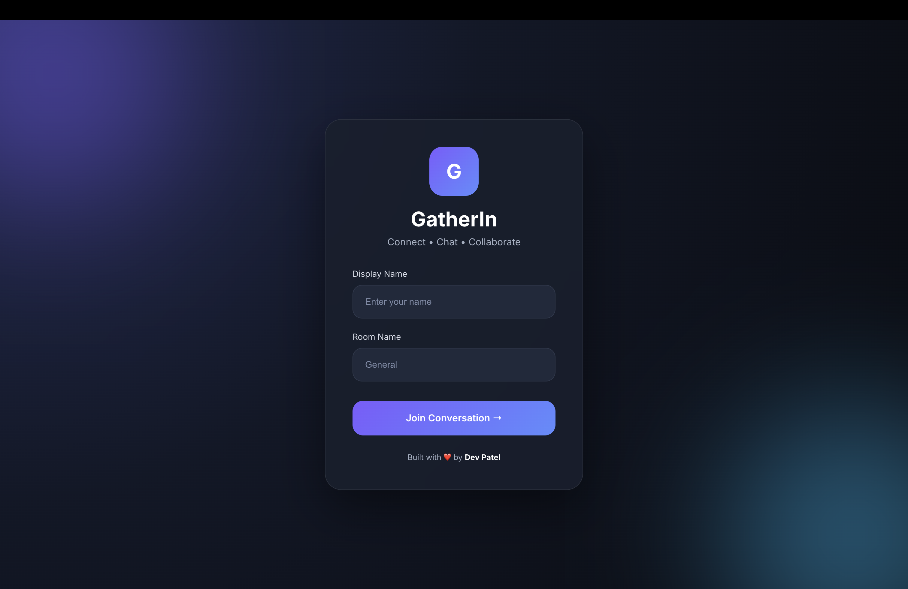
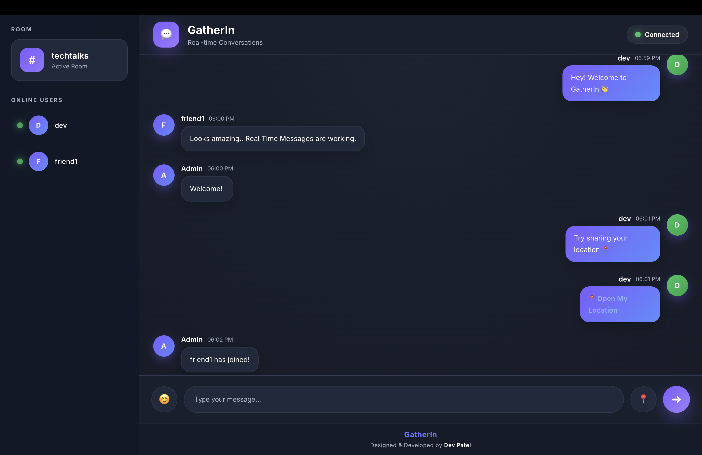
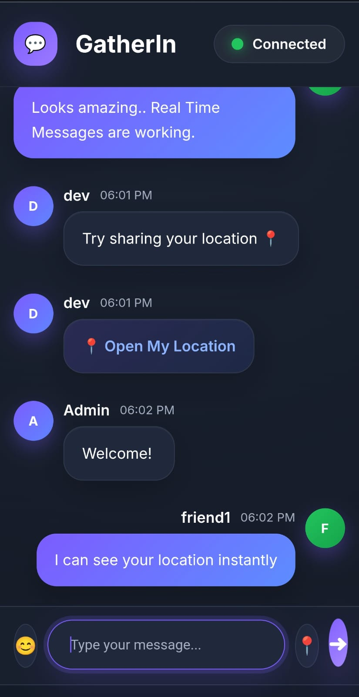
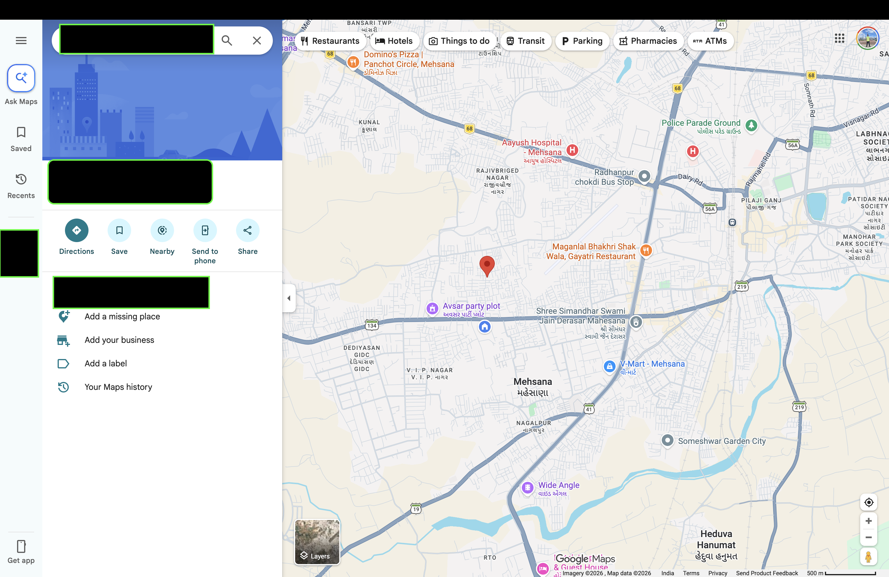
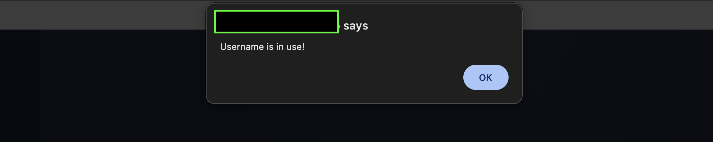

<div align="center">

# 💬 GatherIn

### Connect • Chat • Collaborate

A modern **Real-Time Room-Based Chat Application** built with **Node.js**, **Express.js**, **Socket.IO**, and **MongoDB**.


</div>

---

# 📖 About

GatherIn is a **real-time room-based chat application** where users can instantly communicate inside private chat rooms.

Users simply enter a **display name** and **room name** to join a conversation.

### Key Highlights

- 💬 Real-time messaging
- 👥 Room-based communication
- 🔒 Private conversations
- 🚫 Duplicate usernames are not allowed within the same room
- 🟢 Live online users list
- 📍 Live location sharing
- 📱 Responsive design
- 🌙 Modern dark UI

Only users inside the **same room** can communicate with each other. Users in different rooms cannot see messages or online users from other rooms.

---

# ✨ Features

- ⚡ Real-Time Messaging using Socket.IO
- 👥 Create or Join Chat Rooms
- 🚫 Duplicate Username Validation
- 🔒 Private Room-Based Conversations
- 🟢 Live Online Users List
- 📍 Share Live Location
- 🚫 Profanity Filtering using **bad-words**
- 📱 Responsive Desktop & Mobile UI
- 🎨 Modern Dark Theme
- ☁️ Cloud Deployment using Netlify & Render

---

# 📸 Project Screenshots

## 🔐 Login Page



---

## 💬 Desktop Chat Interface



---

## 📱 Mobile Interface



---

## 📍 Live Location Sharing



---

## 🚫 Duplicate Username Validation



---

# 🛠️ Tech Stack

## Frontend

- HTML5
- CSS3
- JavaScript (ES6)
- Mustache.js
- Moment.js
- Qs
- Socket.IO Client

## Backend

- Node.js
- Express.js
- Socket.IO
- MongoDB
- Mongoose
- dotenv
- bad-words

## Tools

- npm
- Nodemon
- Git
- GitHub
- Netlify
- Render

---

# 📂 Project Structure

```
GatherIn/
│
├── assets/
│   ├── Login.png
│   ├── desktop-chat.png
│   ├── duplicate-user.png
│   ├── location.png
│   └── mobile-chat.png
│
├── backend/
│
├── frontend/
│
└── README.md
```

---

# 🚀 Getting Started

## Clone Repository

```bash
git clone https://github.com/devpatel-1/GatherIn.git
```

## Navigate into the Project

```bash
cd GatherIn
```

## Install Backend Dependencies

```bash
cd backend
npm install
```

## Create Environment Variables

Create a `.env` file inside the backend directory.

```env
PORT=3000
MONGODB_URL=YOUR_MONGODB_CONNECTION_STRING
```

## Start the Server

Development Mode

```bash
npm run dev
```

Production Mode

```bash
npm start
```

---

# 📚 What I Learned

This project helped me gain practical experience with:

- Real-time communication using WebSockets
- Socket.IO events
- Event-driven programming
- Room management
- User validation
- MongoDB & Mongoose
- Browser Geolocation API
- Environment Variables using dotenv
- Client-Server Architecture
- CORS Configuration
- Full-Stack Deployment
- Git & GitHub Workflow

---

# ⚡ Challenges Faced

One of the biggest challenges was deploying the application and configuring **CORS** correctly between the frontend and backend.

Debugging deployment issues improved my understanding of:

- Cross-Origin Resource Sharing (CORS)
- Production deployments
- Backend API configuration
- Environment variables
- Full-stack architecture

---

# 🚀 Future Improvements

- 🔐 User Authentication (JWT)
- 💾 Chat History
- 📷 Image Sharing
- 📎 File Sharing
- 😊 Emoji Reactions
- ⌨️ Typing Indicator
- ✔️ Read Receipts
- 🔔 Push Notifications
- 🌗 Light/Dark Theme Toggle

---

# 🌐 Deployment

- **Frontend:** Netlify
- **Backend:** Render
- **Database:** MongoDB Atlas

> **Note:**  
> This project is currently hosted using free-tier cloud services. To ensure reliability and avoid usage limitations of the free MongoDB Atlas cluster, a public live demo link has not been included.

---

# 👨‍💻 Developer

**Dev Patel**

Computer Engineering Student

- GitHub: https://github.com/devpatel-1

---

# ⭐ Support

If you found this project helpful or interesting, please consider giving it a ⭐ on GitHub.

It motivates me to continue building and sharing more projects.

---

## 📄 License

This project is licensed under the MIT License.